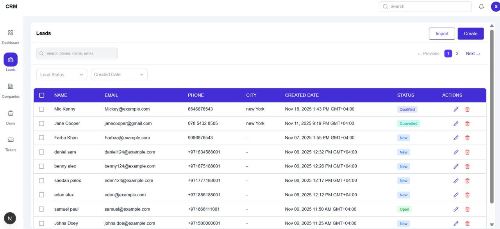
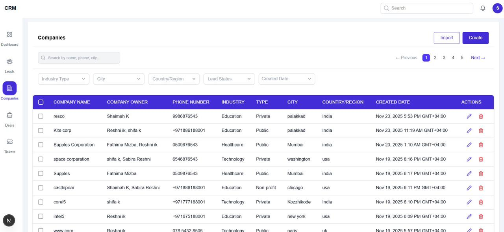
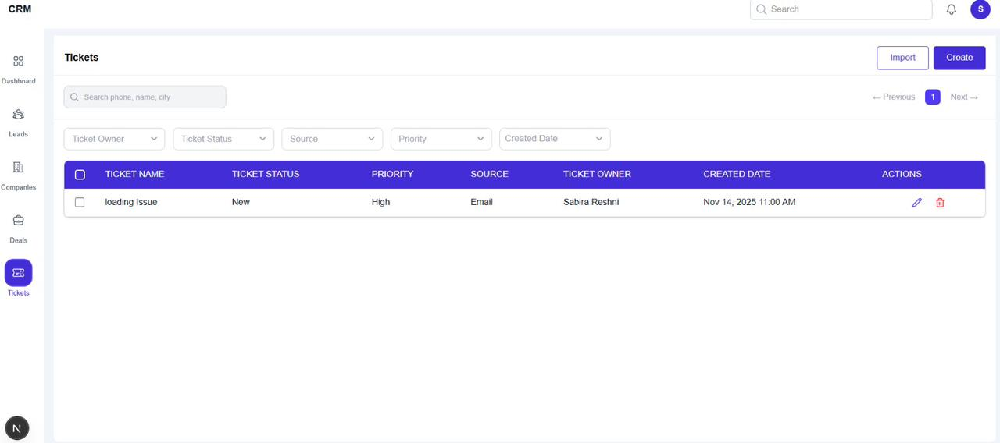
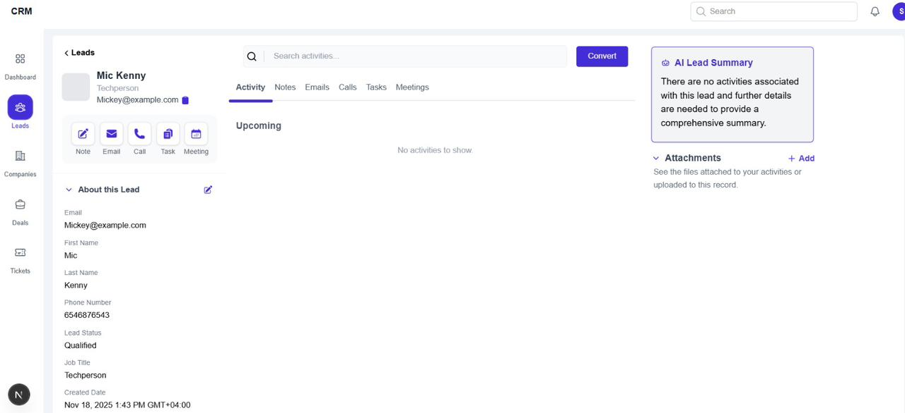
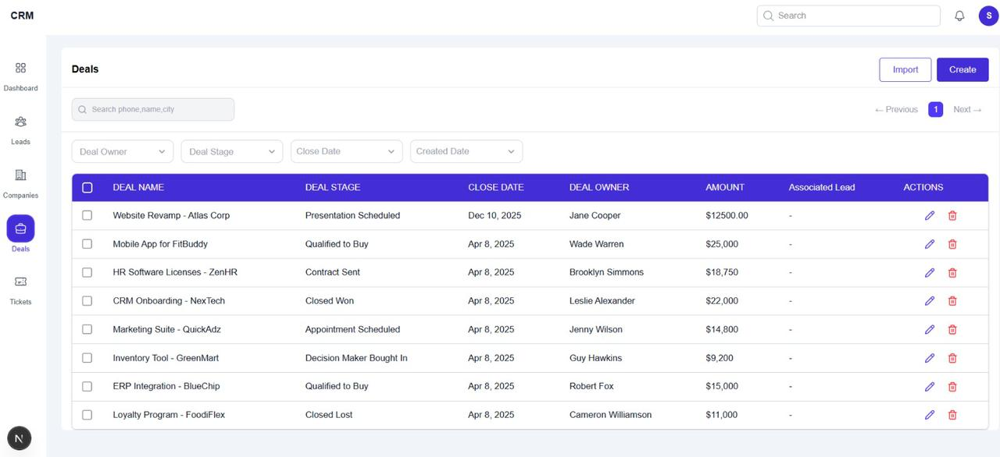
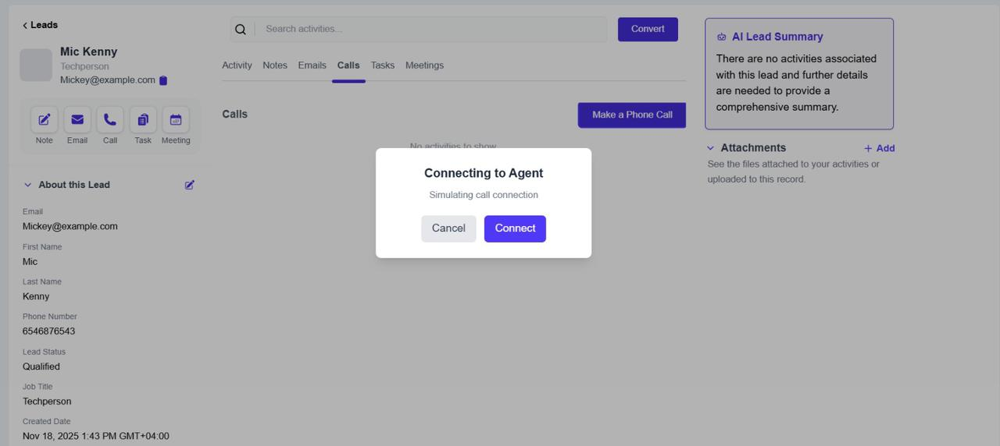

## Live Demo

Frontend (Live Application)  
https://crm-project-frontend-z8uw.vercel.app

Backend API  
https://crm-backend-pswf.onrender.com

Demo Login

Admin Access
Email: Admin2@test.com
Password: 12345

User Access
Email: admin@test.com
Password: 123456

# CRM Frontend Application

This is the frontend of a full stack CRM (Customer Relationship Management) system built using Next.js.  
It provides an interface to manage leads, deals, tickets, companies, and dashboard analytics.

The application communicates with backend REST APIs for data handling and business logic.

---

## Features

- User authentication
- Leads management
- Deals tracking
- Ticket management
- Company records
- Activity tracking
- Dashboard overview
- API integration with backend

---

## Tech Stack

Frontend
- Next.js
- React
- TypeScript
- Tailwind CSS
- Redux Toolkit

Backend
- Node.js
- Express.js
- PostgreSQL
- Sequelize ORM
- JWT Authentication

---

## Deployment

Frontend deployed on Vercel  
Backend deployed on Render  
Database hosted on Neon PostgreSQL

## Getting Started

### 1. Clone the repository

git clone git@github.com:Mizba-Hub/CRM-PROJECT.git

### 2. Install dependencies

npm install

### 3. Run development server

npm run dev

Open http://localhost:3000 in your browser.

---

##  Backend Repository

git@github.com:Mizba-Hub/CRM-BACKEND.git

---

## Environment Variables

Create a `.env.local` file:

NEXT_PUBLIC_API_BASE_URL=https://crm-backend-pswf.onrender.com

## Screenshots

### Dashboard

### Leads Management

### Create Lead

### Companies

### Tickets

### Activities

### Deals

### Call management

##  Project Purpose

This project was developed as part of full stack development practice to build a real-world CRM system with separate frontend and backend architecture.

---

## Author

Fathimathul Mizba  
Full Stack Developer
